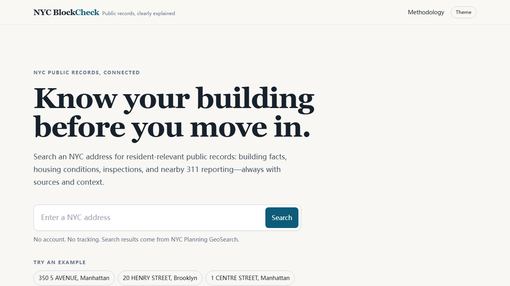
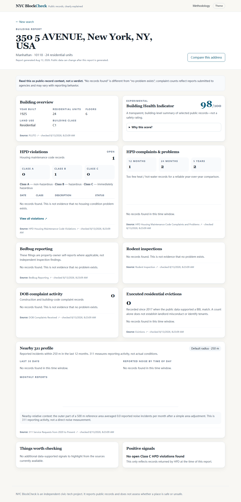

# NYC BlockCheck

**Know your building before you move in.** NYC BlockCheck turns public New York City records into a clear, source-backed building and block report for residents and renters.

It is an independent civic-tech project. It does not declare that a building or neighborhood is safe or unsafe, use demographics or protected characteristics, or make opaque AI-generated ratings.

## Screenshots





## Features

- NYC Planning GeoSearch address autocomplete and shareable report URLs
- PLUTO building facts: year built, units, floors, land use, area, and zoning
- HPD violation severity, open counts, recent history, and an accessible records table
- HPD housing-condition problem counts, deterministic trend language, category breakdowns, and monthly chart
- Bedbug filings, rodent inspections, DOB complaint activity, and executed residential evictions where a building match is supported
- Nearby 311 reporting profile within a 250 m radius, including recent categories, monthly trend, noise time bands, and limited nearby-relative context
- Experimental, deterministic Building Health Indicator with every deduction visible
- Up-to-three-address comparison view
- Per-card source links, fetch status, and explicit “no records found” vs. “no problem exists” language
- Light/dark color themes, responsive layout, keyboard focus styles, semantic tables, SVG chart summaries, and no analytics

## Architecture

```text
src/
  app/                 Next.js App Router pages and /api/search
  components/          Accessible presentation components and lightweight SVG charts
  lib/
    nyc-data/          One validated adapter per external NYC dataset
    scoring/           Transparent building-health calculation and tests
    report.ts          getBuildingReport(address) orchestration and partial-failure handling
```

The browser calls only the address-search route. Data adapters run on the server, use Zod to validate external response shapes, request only the fields needed for the report, and use Socrata SoQL filters rather than downloading whole datasets. Individual failures become visible source-status notices; they cannot blank the report.

## Data sources

| Source                                                                   | Used for                                                  |
| ------------------------------------------------------------------------ | --------------------------------------------------------- |
| [NYC Planning GeoSearch](https://geosearch.planninglabs.nyc/)            | Address resolution, coordinates, BBL/BIN where available  |
| [PLUTO](https://data.cityofnewyork.us/d/64uk-42ks)                       | Building and land-use facts                               |
| [HPD Violations](https://data.cityofnewyork.us/d/wvxf-dwi5)              | Housing maintenance violation records                     |
| [HPD Complaints and Problems](https://data.cityofnewyork.us/d/ygpa-z7cr) | Housing-condition problem records                         |
| [Bedbug Reporting](https://data.cityofnewyork.us/d/wz6d-d3jb)            | Property-owner bedbug filings                             |
| [Rodent Inspection](https://data.cityofnewyork.us/d/p937-wjvj)           | Inspection records and result text                        |
| [DOB Complaints](https://data.cityofnewyork.us/d/eabe-havv)              | DOB complaint activity                                    |
| [Evictions](https://data.cityofnewyork.us/d/6z8x-wfk4)                   | Executed residential evictions with a supported BBL match |
| [311 Service Requests](https://data.cityofnewyork.us/d/erm2-nwe9)        | Nearby service-request reporting activity                 |

Field names were checked against the current official Socrata metadata at implementation time. Dataset fields and coverage can change; the per-source status in the app makes failures visible.

## Local development

Prerequisites: Node.js 20.9 or later and npm.

```bash
git clone https://github.com/Makka-tech/nyc-blockcheck.git
cd nyc-blockcheck
npm install
cp .env.example .env.local # PowerShell: Copy-Item .env.example .env.local
npm run dev
```

Open [http://localhost:3000](http://localhost:3000). The app works without credentials, subject to public NYC API rate limits.

### Environment variables

| Variable            | Required | Description                                                                                                                    |
| ------------------- | -------- | ------------------------------------------------------------------------------------------------------------------------------ |
| `SOCRATA_APP_TOKEN` | No       | A server-only Socrata application token that can improve public Open Data rate limits. It is never sent to browser JavaScript. |

## Testing and quality checks

```bash
npm run lint
npm run typecheck
npm test
npm run build
npm run test:e2e
```

Unit tests cover indicator scoring, HPD severity aggregation, date windows, complaint category grouping, 311 grouping, and address/missing-data parsing. Playwright covers homepage search → report and report → comparison → second address. The browser tests mock address search and run the report service in a fixture mode, so they do not call public APIs.

## Deployment

This is a standard Next.js application. Deploy it to any Node-compatible host (for example Vercel, Render, Fly.io, or a self-hosted Node service), set `SOCRATA_APP_TOKEN` only in the server environment if desired, and use `npm run build && npm start`.

No database, authentication provider, analytics service, proprietary map API, paid API, or user account is required.

## Data limitations and privacy

- Public records can be incomplete, delayed, corrected, or incorrectly address-matched. Open the raw source before making a decision.
- “No records found” is not evidence that no problem exists.
- Complaint counts reflect reports submitted to government agencies; they are not direct measures of noise, housing conditions, or neighborhood quality and may reflect different reporting behavior.
- Bedbug filings are property-owner self-reports where applicable. An eviction count alone does not establish landlord misconduct. The app does not expose tenant names.
- The project has no analytics, trackers, accounts, or application-managed address history. Hosting providers and public services may retain ordinary request logs outside this application’s control.

See the in-app [methodology page](/methodology) for matching, geospatial, cache, scoring, and dataset details.

## Contributing

Contributions are welcome. Read [CONTRIBUTING.md](CONTRIBUTING.md), [CODE_OF_CONDUCT.md](CODE_OF_CONDUCT.md), and [SECURITY.md](SECURITY.md) before opening an issue or pull request.

## Roadmap

- [ ] Let visitors select 100 m, 250 m, or 500 m 311 radii in the report UI.
- [ ] Add exportable, accessible print reports.
- [ ] Improve address matching with additional official identifiers where datasets support them.
- [ ] Add dataset health monitoring and schema-change alerts.

## License

MIT © NYC BlockCheck contributors. See [LICENSE](LICENSE).
